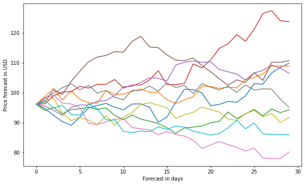
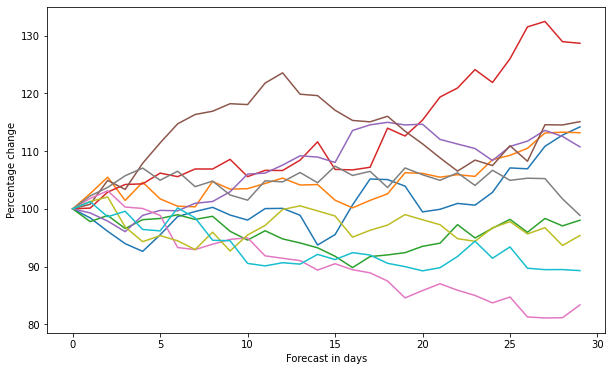

# MonteCarlo-Prediction


Monte Carlo simulation is a method from stochastics, in which a very large number of similar random experiments forms the basis. An attempt is made to solve problems that cannot be solved analytically, or can only be solved at great expense, numerically with the aid of probability theory. As basis above all the law of the large numbers is to be seen. The random experiments can either be carried out in real life - for example by rolling dice - or in computer calculations using Monte Carlo algorithms. In the latter, in order to simulate random events, apparently random numbers are calculated, which are also called pseudo-random numbers.


The following code describes how to calculate a 30-day price prediction for the Tencent stock based on the MonteCarlo method


````python
import pandas as pd
from pandas import Series,DataFrame
import numpy as np
import matplotlib.pyplot as plt
import seaborn as sns
sns.set_style('whitegrid')
%matplotlib inline
import pandas_datareader.data as web
from datetime import datetime
````





