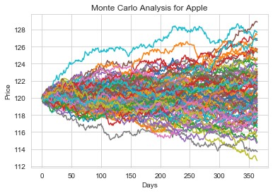
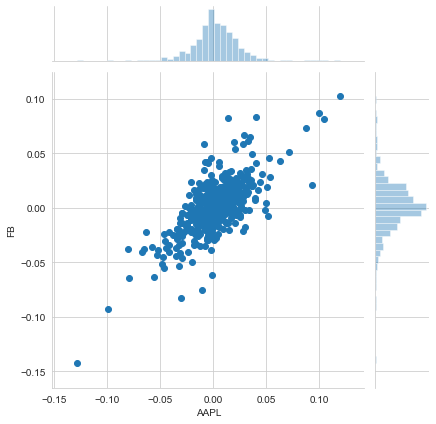
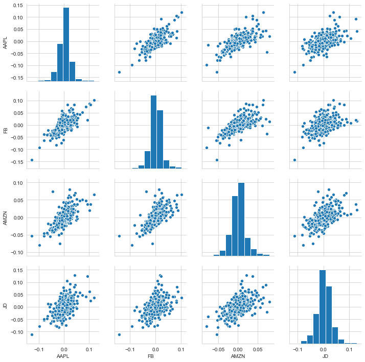
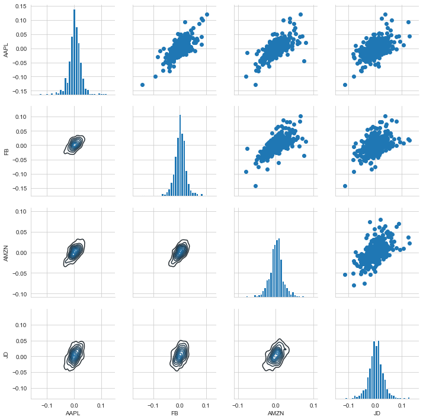
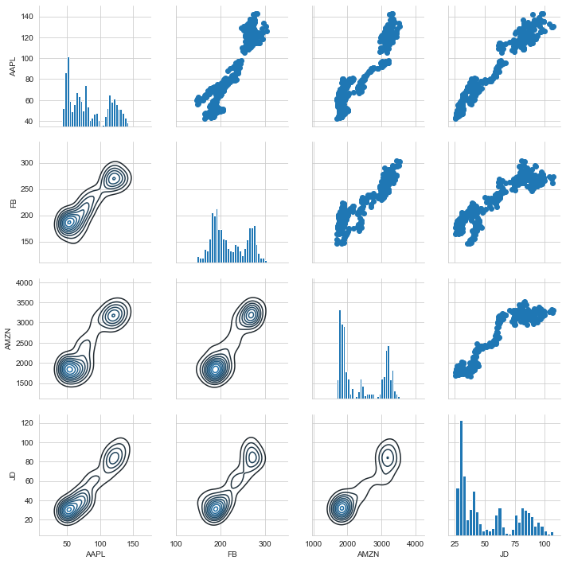
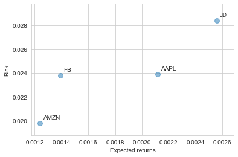
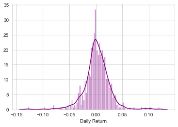
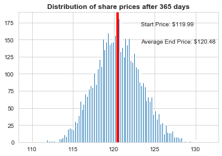

# MonteCarlo-Prediction


Monte Carlo simulation is a method from stochastics, in which a very large number of similar random experiments forms the basis. An attempt is made to solve problems that cannot be solved analytically, or can only be solved at great expense, numerically with the aid of probability theory. As basis above all the law of the large numbers is to be seen. The random experiments can either be carried out in real life - for example by rolling dice - or in computer calculations using Monte Carlo algorithms. In the latter, in order to simulate random events, apparently random numbers are calculated, which are also called pseudo-random numbers.



The following code describes how to calculate a 30-day price prediction for the Tencent stock based on the MonteCarlo method


````python
import pandas as pd
from pandas import Series,DataFrame
import numpy as np
import matplotlib.pyplot as plt
import seaborn as sns
sns.set_style('whitegrid')
%matplotlib inline
import pandas_datareader.data as web
from datetime import datetime
````

````python
end = datetime.now()
start = datetime(end.year - 2,end.month,end.day)
closing_df = web.DataReader(['AAPL','FB','AMZN','JD'],'yahoo',start,end)['Adj Close']
closing_df.head(10)
````
 |    Symbols	 |    AAPL	 |    FB	 |    AMZN	 |    JD |    
 |     :---:      | :---:      | :---:      | :---:      | :---:      | 
 |	2019-03-21 |	47.772057 |	166.080002 |	1819.260010 |	28.760000 |	
 |	2019-03-22 |	46.782772 |	164.339996 |	1764.770020 |	28.000000 |	
 |	2019-03-25 |	46.217113 |	166.289993 |	1774.260010 |	28.389999 |	
 |	2019-03-26 |	45.739620 |	167.679993 |	1783.760010 |	28.809999 |	
 |	2019-03-27 |	46.151005 |	165.869995 |	1765.699951 |	29.160000 |	
 |	2019-03-28 |	46.212219 |	165.550003 |	1773.420044 |	29.410000 |	
 |	2019-03-29 |	46.513416 |	166.690002 |	1780.750000 |	30.150000 |	
 |	2019-04-01 |	46.829304 |	168.699997 |	1814.189941 |	31.260000 |	
 |	2019-04-02 |	47.510036 |	174.199997 |	1813.979980 |	30.290001 |	
 |	2019-04-03 |	47.835732 |	173.539993 |	1820.699951 |	30.309999 |	


````python
# create new pandas framework to represent daily returns
tech_rets = closing_df.pct_change()
tech_rets.head(10)
````

 |    Symbols	 |    AAPL	 |    FB	 |    AMZN	 |    JD |    
 |     :---:      | :---:      | :---:      | :---:      | :---:      | 
 | 2019-03-21 |	NaN |	NaN |	NaN |	NaN | 
 | 2019-03-22 |	-0.020708 |	-0.010477 |	-0.029952 |	-0.026426 | 
 | 2019-03-25 |	-0.012091 |	0.011866 |	0.005377 |	0.013929 | 
 | 2019-03-26 |	-0.010332 |	0.008359 |	0.005354 |	0.014794 | 
 | 2019-03-27 |	0.008994 |	-0.010794 |	-0.010125 |	0.012149 | 
 | 2019-03-28 |	0.001326 |	-0.001929 |	0.004372 |	0.008573 | 
 | 2019-03-29 |	0.006518 |	0.006886 |	0.004133 |	0.025162 | 
 | 2019-04-01 |	0.006791 |	0.012058 |	0.018779 |	0.036816 | 
 | 2019-04-02 |	0.014536 |	0.032602 |	-0.000116 |	-0.031030 | 
 | 2019-04-03 |	0.006855 |	-0.003789 |	0.003705 |	0.000660 | 


````python
# Compare daily percentage returns of two stocks by means of jointplot
sns.jointplot('AAPL','FB',tech_rets,kind='scatter')
````


````python
sns.pairplot(tech_rets.dropna())
````


````python
# daily returns
returns_fig = sns.PairGrid(tech_rets.dropna())
returns_fig.map_upper(plt.scatter)
returns_fig.map_lower(sns.kdeplot)
returns_fig.map_diag(plt.hist,bins=30)
````




````python
# daily close values
returns_fig = sns.PairGrid(closing_df)
returns_fig.map_upper(plt.scatter)
returns_fig.map_lower(sns.kdeplot)
returns_fig.map_diag(plt.hist,bins=30)
````



````python
# Correlation diagramm (corrplot)
tech_corr = tech_rets.corr()
tech_corr
````
| Symbols |	AAPL |	FB |	AMZN |	JD |
| :---: | :---: | :---: | :---: | :---: |
| AAPL |	1.000000 |	0.712022 |	0.678212 |	0.560722 |
| FB |	0.712022 |	1.000000 |	0.680606 |	0.484784 |
| AMZN |	0.678212 |	0.680606 |	1.000000 |	0.560289 |
| JD |	0.560722 |	0.484784 |	0.560289 |	1.000000 |


````python
## Risk Analysis
rets = tech_rets.dropna()
rets.head(10)
````

 |    Symbols |	     AAPL |	     FB |	   AMZN |	    JD |    
 |     :---:      | :---:      | :---:      | :---:      | :---:  | 
 | 2019-03-22 |	-0.020708 |	-0.010477 |	-0.029952 |	-0.026426 | 
 | 2019-03-25 |	-0.012091 |	0.011866 |	0.005377 |	0.013929 | 
 | 2019-03-26 |	-0.010332 |	0.008359 |	0.005354 |	0.014794 | 
 | 2019-03-27 |	0.008994 |	-0.010794 |	-0.010125 |	0.012149 | 
 | 2019-03-28 |	0.001326 |	-0.001929 |	0.004372 |	0.008573 | 
 | 2019-03-29 |	0.006518 |	0.006886 |	0.004133 |	0.025162 | 
 | 2019-04-01 |	0.006791 |	0.012058 |	0.018779 |	0.036816 | 
 | 2019-04-02 |	0.014536 |	0.032602 |	-0.000116 |	-0.031030 | 
 | 2019-04-03 |	0.006855 |	-0.003789 |	0.003705 |	0.000660 | 
 | 2019-04-04 |	0.001740 |	0.014291 |	-0.001011 |	-0.00198 | 


````python
plt.scatter(rets.mean(), rets.std(),alpha = 0.5,s =np.pi*20)
plt.ylim([rets.std().min()*(0.95),rets.std().max()*(1.05)])
plt.xlim([rets.mean().min()*(0.95),rets.mean().max()*(1.05)])
plt.xlabel('Expected returns')
plt.ylabel('Risk')

for label, x, y in zip(rets.columns, rets.mean(), rets.std()):
    plt.annotate(
        label, 
        xy = (x, y), xytext = (5, 5),
        textcoords = 'offset points', ha = 'left', va = 'bottom')
````




Value at Risk using the "Bootstrap" method. A risk measure of a portfolio. 5th quantile of the loss function: 
Specifies to what level of loss will not be exceeded within a given time period (start end) with this probability# Your code here.

````python
sns.distplot(AAPL['Daily Return'].dropna(),bins=100)
rets['JD'].quantile(0.05)
````
````python
-0.04390417202851068
````


The empirical 0.05 quantile of the daily return. This means that with 95% confidence our worst daily loss will not be above the calculated value -0.04390417202851068


# Value at Risk with the Monte Carlo Method
We will use the Monte Carlo method to run many trials with random market conditions. Then we will calculate the portfolio losses for each trial. Subsequently, we will use the aggregation of all these simulations to determine how risky the stock is.
Let's start with a brief explanation of what we will do:

The equation for Geometric Brownian Motion is defined as follows:


````python
days = 365
dt = 1/days
mu = rets.mean()['AAPL']
sigma = rets.std()['AAPL']
start_price = AAPL['Adj Close'][-1] ## start und endwert
def stock_monte_carlo(start_price,days,mu,sigma):
    price = np.zeros(days)
    price[0] = start_price
    shock = np.zeros(days)
    drift = np.zeros(days)
    for x in range(1,days):
        shock[x] = np.random.normal(loc=mu * dt, scale=sigma * np.sqrt(dt))
        drift[x] = mu * dt
        price[x] = price[x-1] + (price[x-1] * (drift[x] + shock[x]))
    return price

for run in range(100):
    plt.plot(stock_monte_carlo(start_price,days,mu,sigma))
plt.xlabel("Days")
plt.ylabel("Price")  
plt.title('Monte Carlo Analysis for Apple')
````


````python
runs = 10000
simulations = np.zeros(runs)
np.set_printoptions(threshold=5)
for run in range(runs):    
    simulations[run] = stock_monte_carlo(start_price,days,mu,sigma)[days-1]
    
plt.hist(simulations,bins=200)
plt.figtext(0.6, 0.8, s="Start Price: $%.2f" %start_price)
plt.figtext(0.6, 0.7, "Average End Price: $%.2f" % simulations.mean())
plt.axvline(x=np.median(simulations) , linewidth=4, color='r')
plt.title(u"Distribution of share prices after %s days" % days, weight='bold');
````


