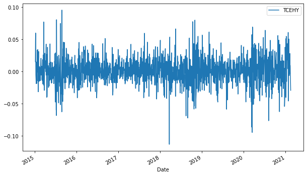
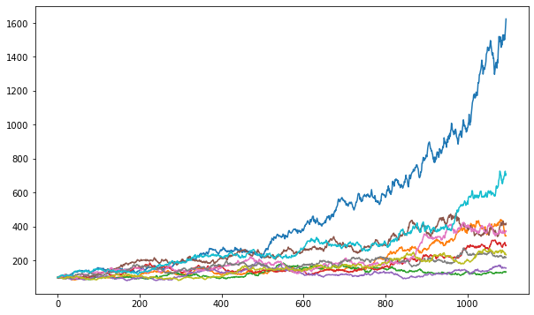

# MonteCarlo-Prediction


Monte Carlo simulation is a method from stochastics, in which a very large number of similar random experiments forms the basis. An attempt is made to solve problems that cannot be solved analytically, or can only be solved at great expense, numerically with the aid of probability theory. As basis above all the law of the large numbers is to be seen. The random experiments can either be carried out in real life - for example by rolling dice - or in computer calculations using Monte Carlo algorithms. In the latter, in order to simulate random events, apparently random numbers are calculated, which are also called pseudo-random numbers.


````python
import numpy as np  
import pandas as pd  
from pandas_datareader import data as wb  
import matplotlib.pyplot as plt  
from scipy.stats import norm
%matplotlib inline

Stocks = ['TCEHY']

t_intervals = 30
iterations = 10
StartDate = '2015-01-01'

for i in Stocks:
    print(i)
    data = pd.DataFrame()
    data[i] = wb.DataReader(i, data_source='yahoo', start=StartDate)['Adj Close']

    log_returns = np.log(1 + data.pct_change())
    log_returns.tail()

    data.plot(figsize=(10, 6))
    log_returns.plot(figsize = (10, 6))

    print("")
    u = log_returns.mean()
    print("Log Mittelwert:")
    print(u)

    print("")
    var = log_returns.var()
    print("Log Varianz:")
    print(var)

    print("")
    drift = u - (0.5 * var)
    np.array(drift)
    drift.values
    print("Drift:")
    print(drift)

    print("")
    stdev = log_returns.std()
    stdev.values
    print("STD")
    print(stdev)

    norm.ppf(0.95)

    print("")
    x = np.random.rand(10, 2)
    norm.ppf(x)

    print("")
    Z = norm.ppf(np.random.rand(10,2))
    print("Z")
    print(Z)

    print("")
    daily_returns = np.exp(drift.values + stdev.values * norm.ppf(np.random.rand(t_intervals, iterations)))
    print("daily_returns")
    print(daily_returns)

    print("")
    S0 = data.iloc[-1]
    print("Startwert S0")
    print(S0[0])


    print("")
    price_list = np.zeros_like(daily_returns)
    print("Matrix initiating")
    print(price_list)

    print("")
    price_list[0] = S0
    print("Fill matrix first row with start value S0")
    print(price_list)

    print("")
    for t in range(1, t_intervals):
        price_list[t] = price_list[t - 1] * daily_returns[t]
    print("Fill matrix with all numbers in a loop")
    print(price_list)
    plt.figure(figsize=(10,6))
    plt.plot(price_list)
    plt.xlabel('Forecast in days')
    plt.ylabel('Price forecast in USD')


    print("")
    price_list1 = ((price_list/S0[0])*100)
    print("Indicate matrix to 100%")
    print(price_list1)
    plt.figure(figsize=(10,6))
    
    plt.plot(price_list1)
    plt.xlabel('Forecast in days')
    plt.ylabel('Percentage change')

    print("")
    print("Mittelwert der Vorhersage")
    print(price_list1[-1].mean())
````






